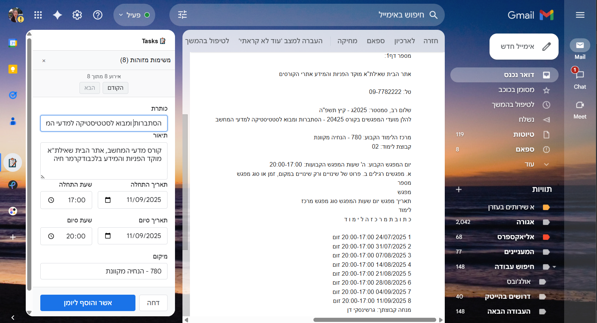
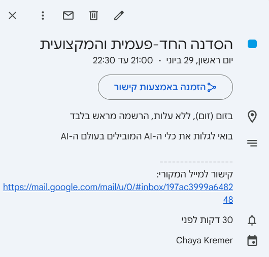

# Gmail Event Extractor 🗓️

## Overview

**Gmail Event Extractor** is a Chrome extension that automatically detects events from your Gmail emails using AI and allows you to add them directly to your Google Calendar with one click. The extension provides an intelligent sidebar that analyzes email content and extracts event details like dates, times, locations, and descriptions.

🌟 **Now available on Chrome Web Store:** [Install Gmail Event Extractor](https://chromewebstore.google.com/detail/gmail-event-extractor/kdekhldekjdglgcjdeplonnfdeonofho?authuser=0&hl=iw)

---

## ✨ Key Features

- **🤖 AI-Powered Event Detection**: Uses GROQ API to intelligently extract events from email content
- **📧 Gmail Integration**: Seamlessly integrates with Gmail using InboxSDK
- **📅 Google Calendar Integration**: One-click event creation with automatic email linking
- **🎨 Interactive Sidebar**: Clean, modern UI built with Preact
- **✏️ Event Editing**: Edit event details before adding to calendar
- **✅ Approve/Reject System**: Review each detected event before adding
- **🔗 Email Linking**: Every calendar event includes a link back to the original email
- **🔐 Secure Authentication**: OAuth integration for Google Calendar access
- **📱 Responsive Design**: Works smoothly across different Gmail layouts

---

## 🚀 Installation

### From Chrome Web Store (Recommended)
1. Visit the [Chrome Web Store page](https://chromewebstore.google.com/detail/gmail-event-extractor/kdekhldekjdglgcjdeplonnfdeonofho?authuser=0&hl=iw)
2. Click "Add to Chrome"
3. Follow the installation prompts

### For Developers
1. **Clone the repository:**
   ```bash
   git clone https://github.com/ChayaCodes/gmail-task-extractor.git
   cd gmail-task-extractor
   ```

2. **Install dependencies:**
   ```bash
   npm install
   ```

3. **Create environment file:**
   ```bash
   cp .env.example .env
   # Add your GROQ API key to .env
   ```

4. **Build the extension:**
   ```bash
   npm run build
   ```

5. **Package for distribution:**
   ```bash
   npm run package
   ```

6. **Load in Chrome:**
   - Go to `chrome://extensions/`
   - Enable "Developer mode"
   - Click "Load unpacked" and select the `dist` directory

---

## 🔧 Configuration

### First Time Setup

1. **Google Calendar Access**: When you first approve an event, you'll authenticate with Google
   - OAuth flow ensures secure access to your calendar
   - Permissions are requested only for calendar events

---

## 📱 How to Use

### Automatic Detection
1. Open any Gmail email
2. If events are detected, the sidebar will automatically appear
3. Review the extracted event details
4. Edit if needed using the form
5. Click **Approve** to add to calendar or **Reject** to dismiss

### Manual Operation
1. Click the Gmail Event Extractor icon in Gmail's sidebar
2. Manually add events using the form
3. All the same features available as automatic detection

### Navigation
- Use **Previous/Next** buttons to navigate between multiple detected events
- Each event can be individually approved or rejected
- Sidebar updates in real-time as events are processed

---

## 🏗️ Technical Architecture

### Project Structure
```
src/
├── background/           # Chrome extension background scripts
│   └── background.ts    # OAuth and permissions handling
├── content/             # Gmail integration
│   └── main.ts         # Main application logic and event handling
├── services/           # Core business logic
│   ├── ai/
│   │   └── groq-service.ts     # AI event extraction
│   ├── auth/
│   │   └── oauth-service.ts    # Google OAuth handling
│   ├── calendar/
│   │   └── google-calendar.ts  # Calendar API integration
│   ├── email/
│   │   └── email-parser.ts     # Email content parsing
│   └── inboxSDK/
│       ├── inbox-sdk.service.ts     # Gmail SDK wrapper
│       └── inbox-sdk-ui.service.ts  # UI management
├── ui/                 # User interface components
│   ├── components/
│   │   └── events/
│   │       ├── EventSidebar.tsx    # Main sidebar component
│   │       ├── EventForm.tsx       # Event editing form
│   │       ├── EventActions.tsx    # Approve/reject buttons
│   │       └── EventNavigation.tsx # Event navigation
│   └── styles/         # CSS styling
├── types/              # TypeScript type definitions
│   ├── event.types.ts  # Event data structures
│   └── email.types.ts  # Email data structures
└── utils/              # Utility functions
    ├── logger.ts       # Logging utilities
    └── storage.ts      # Data persistence
```

### Technology Stack
- **Framework**: Chrome Extension Manifest V3
- **UI**: Preact (lightweight React alternative)
- **Gmail Integration**: InboxSDK
- **AI**: GROQ API
- **Calendar**: Google Calendar API
- **Authentication**: Google OAuth 2.0
- **Build**: Webpack
- **Language**: TypeScript
- **Testing**: Jest

---

## 🛠️ Development

### Available Scripts
```bash
npm run dev          # Development build with source maps
npm run build        # Production build
npm run watch        # Development with auto-rebuild
npm run package      # Build and create distribution zip
npm run test         # Run all tests
npm run test:unit    # Unit tests only
npm run test:integration  # Integration tests only
```

### Architecture Principles
- **Separation of Concerns**: Clear separation between business logic and UI
- **Modular Design**: Each service handles a specific responsibility
- **Type Safety**: Full TypeScript coverage
- **Error Handling**: Comprehensive error handling and user feedback
- **Performance**: Optimized for Gmail's environment

---

## 🔒 Privacy & Security

- **Local Storage**: API keys stored securely in Chrome's local storage
- **OAuth**: Google authentication follows OAuth 2.0 best practices
- **Permissions**: Minimal required permissions requested
- **No Data Collection**: Extension doesn't collect or transmit personal data
- **Email Linking**: Calendar events include links to original emails for context

---

## 🧪 Testing

The extension includes comprehensive testing:

```bash
# Run all tests
npm test

# Unit tests for individual components
npm run test:unit

# Integration tests for service interactions
npm run test:integration

# Watch mode for development
npm run test:watch
```

---

## 🤝 Contributing

Contributions are welcome! Please feel free to submit issues, feature requests, or pull requests.

### Development Setup
1. Fork the repository
2. Create a feature branch
3. Make your changes
4. Run tests to ensure everything works
5. Submit a pull request

---

## 📄 License

MIT License - see [LICENSE](LICENSE) file for details.

---

## 📞 Support

- **Issues**: [GitHub Issues](https://github.com/ChayaCodes/gmail-task-extractor/issues)
- **Chrome Web Store**: [Extension Page](https://chromewebstore.google.com/detail/gmail-event-extractor/kdekhldekjdglgcjdeplonnfdeonofho?authuser=0&hl=iw)

---

## 📸 Screenshots

### Gmail sidebar with detected events


### Event added to Google Calendar


---

**Made with ❤️ by [Chaya Kremer](https://github.com/ChayaCodes)**
